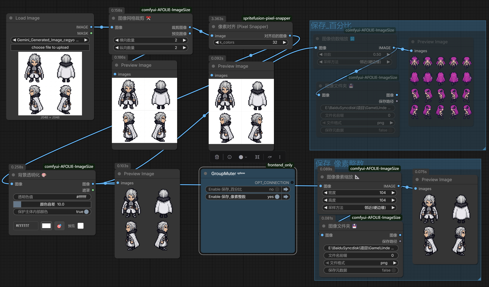

# AFOLIE ImageSize - ComfyUI Custom Nodes

<div align="center">

**🌍 Language / 语言 / 言語 / 언어 / Sprache / Lingua / Språk**

[English](#english) | [中文](#中文) | [日本語](#日本語) | [한국어](#한국어) | [Deutsch](#deutsch) | [Italiano](#italiano) | [Svenska](#svenska)

</div>

---

<a name="english"></a>
## 🇬🇧 English

A comprehensive ComfyUI custom node collection for image processing, providing Photoshop-like image resizing, batch image loading, background transparency, pixel alignment, and custom folder saving functionality.

### 📦 Features Overview

This plugin provides **9 powerful nodes** organized into four categories:

#### 🖼️ Image Processing (AFOLIE/图像)
| Node | Description |
|------|-------------|
| **Image Pixel Resize 📐** | Pixel-based image resizing with 7 resampling methods |
| **Image Scale Resize 🔢** | Scale-based image resizing (0.01x - 12x) |
| **Image Grid Crop ✂️** | Split image into grid cells |
| **Pixel Alignment 🎯** | Align pixels to perfect grid for pixel art |
| **Background Transparent 🎨** | Convert specified color background to transparent |

#### 📥 Input Nodes (AFOLIE/输入)
| Node | Description |
|------|-------------|
| **Input Batch Images 📁** | Load batch images preserving original sizes |
| **Input Batch Images Pixels 📐** | Load and resize to uniform pixel dimensions |
| **Input Batch Images Scale 🔢** | Load and scale by multiplier |

#### 💾 Output Nodes (AFOLIE/输出)
| Node | Description |
|------|-------------|
| **Image Folder 💾** | Save images to custom folder paths |

### 📸 Screenshots




### 🎯 Key Features

#### Background Transparent 🎨
- Hex color input (#ffffff format)
- Color picker with HSB slider
- Color tolerance slider (0-100%)
- Protect internal colors option

#### Pixel Alignment 🎯
- Align pixels to perfect grid
- Fix AI-generated pixel art inconsistencies
- Quantize colors to strict palette
- Preserve details like dithering

#### Image Grid Crop ✂️
- Split image into horizontal × vertical grid
- Set 0 to skip that direction (for strips)
- Batch processing support

### 📥 Installation

```bash
cd ComfyUI/custom_nodes
git clone https://github.com/yourusername/comfyui-AFOLIE-ImageSize.git
```

### 📋 Requirements

```
torch>=1.9.0
numpy>=1.21.0
Pillow>=8.0.0
scipy>=1.7.0
```

### 📝 License

GPL-3.0 License

### 👤 Author

AFOLIE

---

<a name="中文"></a>
## 🇨🇳 中文

ComfyUI 自定义节点集合，提供类似 Photoshop 的图像大小调整、批量图像加载、背景透明化、像素对齐和自定义文件夹保存功能。

### 📦 功能概览

本插件提供 **9 个强大的节点**，分为四个类别：

#### 🖼️ 图像处理 (AFOLIE/图像)
| 节点 | 说明 |
|------|------|
| **图像像素缩放 📐** | 基于像素的图像大小调整，支持 7 种采样方法 |
| **图像倍数缩放 🔢** | 基于倍数的图像缩放 (0.01x - 12x) |
| **图像网格裁剪 ✂️** | 将图像分割成网格单元 |
| **像素对齐 🎯** | 将像素对齐到完美网格，适用于像素艺术 |
| **背景透明化 🎨** | 将指定颜色的背景转换为透明 |

#### 📥 输入节点 (AFOLIE/输入)
| 节点 | 说明 |
|------|------|
| **Input批次图像 📁** | 加载批次图像，保持原始尺寸 |
| **Input批次图像像素 📐** | 加载并调整到统一像素尺寸 |
| **Input批次图像倍数 🔢** | 加载并按倍数统一缩放 |

#### 💾 输出节点 (AFOLIE/输出)
| 节点 | 说明 |
|------|------|
| **图像文件夹 💾** | 保存图像到自定义文件夹路径 |

### 📸 截图


### 🎯 主要功能

#### 背景透明化 🎨
- 十六进制颜色输入 (#ffffff 格式)
- 颜色选择器，支持色相立方体和 HSB 滑块
- 颜色容差滑块 (0-100%)
- 保护主体内部颜色选项

#### 像素对齐 🎯
- 将像素对齐到完美网格
- 修复 AI 生成像素艺术的不一致
- 量化颜色到严格的调色板
- 保持细节（如抖动）

#### 图像网格裁剪 ✂️
- 将图像分割成 横向 × 纵向 网格
- 设置 0 跳过该方向（用于裁剪长条）
- 支持批量处理

### 📥 安装方法

```bash
cd ComfyUI/custom_nodes
git clone https://github.com/yourusername/comfyui-AFOLIE-ImageSize.git
```

### 📋 依赖

```
torch>=1.9.0
numpy>=1.21.0
Pillow>=8.0.0
scipy>=1.7.0
```

### 📝 许可证

GPL-3.0 许可证

### 👤 作者

AFOLIE

---

<a name="日本語"></a>
## 🇯🇵 日本語

画像処理のための包括的な ComfyUI カスタムノードコレクション。Photoshop のような画像リサイズ、バッチ画像読み込み、背景透明化、ピクセルアライメント、カスタムフォルダ保存機能を提供します。

### 📦 機能概要

このプラグインは **9 つの強力なノード** を 4 つのカテゴリに分けて提供します：

#### 🖼️ 画像処理 (AFOLIE/图像)
| ノード | 説明 |
|--------|------|
| **画像ピクセルリサイズ 📐** | ピクセルベースの画像リサイズ、7 種類のリサンプリング方法 |
| **画像倍率リサイズ 🔢** | 倍率ベースの画像リサイズ (0.01x - 12x) |
| **画像グリッドクロップ ✂️** | 画像をグリッドセルに分割 |
| **ピクセルアライメント 🎯** | ピクセルアートのためにピクセルを完璧なグリッドに整列 |
| **背景透明化 🎨** | 指定した色の背景を透明に変換 |

#### 📥 入力ノード (AFOLIE/输入)
| ノード | 説明 |
|--------|------|
| **バッチ画像入力 📁** | 元のサイズを保持してバッチ画像を読み込み |
| **バッチ画像ピクセル入力 📐** | 統一ピクセルサイズにリサイズして読み込み |
| **バッチ画像倍率入力 🔢** | 倍率で統一スケーリングして読み込み |

#### 💾 出力ノード (AFOLIE/输出)
| ノード | 説明 |
|--------|------|
| **画像フォルダ 💾** | カスタムフォルダパスに画像を保存 |

### 📸 スクリーンショット


### 🎯 主な機能

#### 背景透明化 🎨
- 16 進数カラー入力 (#ffffff 形式)
- HSB スライダー付きカラーピッカー
- 色許容度スライダー (0-100%)
- 内部色保護オプション

#### ピクセルアライメント 🎯
- ピクセルを完璧なグリッドに整列
- AI 生成ピクセルアートの不整合を修正
- 厳密なパレットに色を量子化
- ディザリングなどの詳細を保持

### 📥 インストール

```bash
cd ComfyUI/custom_nodes
git clone https://github.com/yourusername/comfyui-AFOLIE-ImageSize.git
```

### 📝 ライセンス

GPL-3.0 ライセンス

### 👤 作者

AFOLIE

---

<a name="한국어"></a>
## 🇰🇷 한국어

이미지 처리를 위한 포괄적인 ComfyUI 커스텀 노드 컬렉션. Photoshop과 유사한 이미지 크기 조정, 배치 이미지 로딩, 배경 투명화, 픽셀 정렬 및 사용자 정의 폴더 저장 기능을 제공합니다.

### 📦 기능 개요

이 플러그인은 4개 카테고리로 구성된 **9개의 강력한 노드**를 제공합니다:

#### 🖼️ 이미지 처리 (AFOLIE/图像)
| 노드 | 설명 |
|------|------|
| **이미지 픽셀 리사이즈 📐** | 픽셀 기반 이미지 크기 조정, 7가지 리샘플링 방법 |
| **이미지 배율 리사이즈 🔢** | 배율 기반 이미지 크기 조정 (0.01x - 12x) |
| **이미지 그리드 자르기 ✂️** | 이미지를 그리드 셀로 분할 |
| **픽셀 정렬 🎯** | 픽셀 아트를 위해 픽셀을 완벽한 그리드에 정렬 |
| **배경 투명화 🎨** | 지정된 색상의 배경을 투명으로 변환 |

#### 📥 입력 노드 (AFOLIE/输入)
| 노드 | 설명 |
|------|------|
| **배치 이미지 입력 📁** | 원본 크기를 유지하며 배치 이미지 로드 |
| **배치 이미지 픽셀 입력 📐** | 통일된 픽셀 크기로 리사이즈하여 로드 |
| **배치 이미지 배율 입력 🔢** | 배율로 통일 스케일링하여 로드 |

#### 💾 출력 노드 (AFOLIE/输出)
| 노드 | 설명 |
|------|------|
| **이미지 폴더 💾** | 사용자 정의 폴더 경로에 이미지 저장 |

### 📸 스크린샷


### 🎯 주요 기능

#### 배경 투명화 🎨
- 16진수 색상 입력 (#ffffff 형식)
- HSB 슬라이더가 있는 색상 선택기
- 색상 허용 오차 슬라이더 (0-100%)
- 내부 색상 보호 옵션

#### 픽셀 정렬 🎯
- 픽셀을 완벽한 그리드에 정렬
- AI 생성 픽셀 아트의 불일치 수정
- 엄격한 팔레트로 색상 양자화
- 디더링과 같은 세부 사항 유지

### 📥 설치

```bash
cd ComfyUI/custom_nodes
git clone https://github.com/yourusername/comfyui-AFOLIE-ImageSize.git
```

### 📝 라이선스

GPL-3.0 라이선스

### 👤 작성자

AFOLIE

---

<a name="deutsch"></a>
## 🇩🇪 Deutsch

Eine umfassende ComfyUI Custom Node-Sammlung für die Bildverarbeitung. Bietet Photoshop-ähnliche Bildgrößenänderung, Batch-Bildladung, Hintergrundtransparenz, Pixelausrichtung und benutzerdefinierte Ordnerspeicherung.

### 📦 Funktionsübersicht

Dieses Plugin bietet **9 leistungsstarke Nodes** in vier Kategorien:

#### 🖼️ Bildverarbeitung (AFOLIE/图像)
| Node | Beschreibung |
|------|--------------|
| **Bild-Pixel-Größenänderung 📐** | Pixelbasierte Bildgrößenänderung mit 7 Resampling-Methoden |
| **Bild-Skalierung 🔢** | Skalierungsbasierte Bildgrößenänderung (0,01x - 12x) |
| **Bild-Raster-Zuschnitt ✂️** | Bild in Rasterzellen aufteilen |
| **Pixelausrichtung 🎯** | Pixel für Pixel-Art am perfekten Raster ausrichten |
| **Hintergrund-Transparenz 🎨** | Angegebene Hintergrundfarbe in transparent umwandeln |

#### 📥 Eingabe-Nodes (AFOLIE/输入)
| Node | Beschreibung |
|------|--------------|
| **Batch-Bilder-Eingabe 📁** | Batch-Bilder mit Originalgrößen laden |
| **Batch-Bilder-Pixel-Eingabe 📐** | Laden und auf einheitliche Pixelgröße anpassen |
| **Batch-Bilder-Skalierung-Eingabe 🔢** | Laden und mit Multiplikator skalieren |

#### 💾 Ausgabe-Nodes (AFOLIE/输出)
| Node | Beschreibung |
|------|--------------|
| **Bildordner 💾** | Bilder in benutzerdefinierten Ordnerpfaden speichern |

### 📸 Screenshots


### 🎯 Hauptfunktionen

#### Hintergrund-Transparenz 🎨
- Hex-Farbeingabe (#ffffff Format)
- Farbwähler mit HSB-Schieberegler
- Farbtoleranz-Schieberegler (0-100%)
- Option zum Schutz interner Farben

#### Pixelausrichtung 🎯
- Pixel am perfekten Raster ausrichten
- Inkonsistenzen in KI-generierter Pixel-Art beheben
- Farben auf strenge Palette quantisieren
- Details wie Dithering beibehalten

### 📥 Installation

```bash
cd ComfyUI/custom_nodes
git clone https://github.com/yourusername/comfyui-AFOLIE-ImageSize.git
```

### 📝 Lizenz

GPL-3.0 Lizenz

### 👤 Autor

AFOLIE

---

<a name="italiano"></a>
## 🇮🇹 Italiano

Una collezione completa di nodi personalizzati ComfyUI per l'elaborazione delle immagini. Fornisce ridimensionamento immagini simile a Photoshop, caricamento batch di immagini, trasparenza dello sfondo, allineamento pixel e salvataggio in cartelle personalizzate.

### 📦 Panoramica delle Funzionalità

Questo plugin fornisce **9 potenti nodi** organizzati in quattro categorie:

#### 🖼️ Elaborazione Immagini (AFOLIE/图像)
| Nodo | Descrizione |
|------|-------------|
| **Ridimensionamento Pixel Immagine 📐** | Ridimensionamento basato su pixel con 7 metodi di ricampionamento |
| **Ridimensionamento Scala Immagine 🔢** | Ridimensionamento basato su scala (0,01x - 12x) |
| **Ritaglio Griglia Immagine ✂️** | Dividere l'immagine in celle della griglia |
| **Allineamento Pixel 🎯** | Allineare i pixel alla griglia perfetta per pixel art |
| **Trasparenza Sfondo 🎨** | Convertire il colore di sfondo specificato in trasparente |

#### 📥 Nodi di Input (AFOLIE/输入)
| Nodo | Descrizione |
|------|-------------|
| **Input Immagini Batch 📁** | Caricare immagini batch mantenendo le dimensioni originali |
| **Input Immagini Batch Pixel 📐** | Caricare e ridimensionare a dimensioni pixel uniformi |
| **Input Immagini Batch Scala 🔢** | Caricare e scalare con moltiplicatore |

#### 💾 Nodi di Output (AFOLIE/输出)
| Nodo | Descrizione |
|------|-------------|
| **Cartella Immagini 💾** | Salvare immagini in percorsi cartella personalizzati |

### 📸 Screenshot


### 🎯 Funzionalità Principali

#### Trasparenza Sfondo 🎨
- Input colore esadecimale (formato #ffffff)
- Selettore colore con cursore HSB
- Cursore tolleranza colore (0-100%)
- Opzione protezione colori interni

#### Allineamento Pixel 🎯
- Allineare i pixel alla griglia perfetta
- Correggere le incongruenze nella pixel art generata da AI
- Quantizzare i colori in una palette rigorosa
- Preservare dettagli come il dithering

### 📥 Installazione

```bash
cd ComfyUI/custom_nodes
git clone https://github.com/yourusername/comfyui-AFOLIE-ImageSize.git
```

### 📝 Licenza

Licenza GPL-3.0

### 👤 Autore

AFOLIE

---

<a name="svenska"></a>
## 🇸🇪 Svenska

En omfattande ComfyUI anpassad nodsamling för bildbehandling. Tillhandahåller Photoshop-liknande bildstorleksändring, batch-bildladdning, bakgrundstransparens, pixeljustering och anpassad mapplagring.

### 📦 Funktionsöversikt

Detta plugin tillhandahåller **9 kraftfulla noder** organiserade i fyra kategorier:

#### 🖼️ Bildbehandling (AFOLIE/图像)
| Nod | Beskrivning |
|-----|-------------|
| **Bild Pixel Storleksändring 📐** | Pixelbaserad bildstorleksändring med 7 omsamplingsmetoder |
| **Bild Skala Storleksändring 🔢** | Skalbaserad bildstorleksändring (0,01x - 12x) |
| **Bild Rutnät Beskärning ✂️** | Dela upp bild i rutnätsceller |
| **Pixeljustering 🎯** | Justera pixlar till perfekt rutnät för pixelkonst |
| **Bakgrundstransparens 🎨** | Konvertera angiven bakgrundsfärg till transparent |

#### 📥 Inmatningsnoder (AFOLIE/输入)
| Nod | Beskrivning |
|-----|-------------|
| **Batch-bilder Inmatning 📁** | Ladda batch-bilder med originalstorlekar |
| **Batch-bilder Pixel Inmatning 📐** | Ladda och ändra storlek till enhetliga pixeldimensioner |
| **Batch-bilder Skala Inmatning 🔢** | Ladda och skala med multiplikator |

#### 💾 Utmatningsnoder (AFOLIE/输出)
| Nod | Beskrivning |
|-----|-------------|
| **Bildmapp 💾** | Spara bilder till anpassade mappsökvägar |

### 📸 Skärmdumpar


### 🎯 Huvudfunktioner

#### Bakgrundstransparens 🎨
- Hex-färginmatning (#ffffff format)
- Färgväljare med HSB-reglage
- Färgtolerans-reglage (0-100%)
- Alternativ för att skydda interna färger

#### Pixeljustering 🎯
- Justera pixlar till perfekt rutnät
- Fixa inkonsekvenser i AI-genererad pixelkonst
- Kvantisera färger till strikt palett
- Bevara detaljer som dithering

### 📥 Installation

```bash
cd ComfyUI/custom_nodes
git clone https://github.com/yourusername/comfyui-AFOLIE-ImageSize.git
```

### 📝 Licens

GPL-3.0 Licens

### 👤 Författare

AFOLIE

---

## 📋 Version History / 版本历史

### v1.1.0 (2025-12-19)
- ✅ Added Pixel Alignment node (像素对齐)
- ✅ Added Background Transparent node (背景透明化)
- ✅ Added Image Grid Crop node (图像网格裁剪)
- ✅ Multi-language README support

### v1.0.0 (2025-12-13)
- ✅ Initial release
- ✅ Image Pixel Resize node
- ✅ Image Scale Resize node
- ✅ Three Input batch nodes
- ✅ Image Folder save node

---

<div align="center">

**Made with ❤️ by AFOLIE**

</div>
